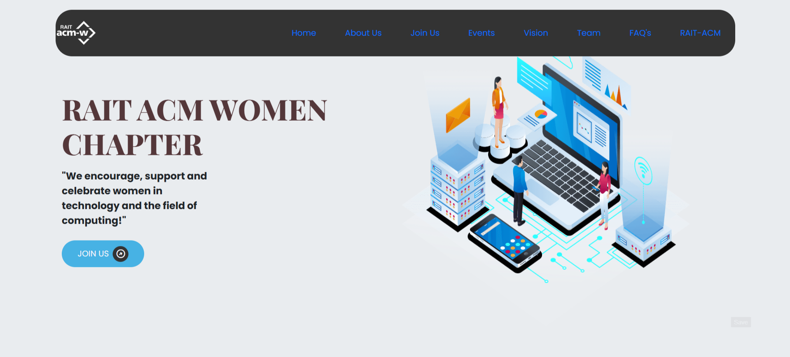

# RAIT ACM Women Chapter Clone

This repository is a clone of the RAIT ACM Women Chapter website. It is designed to replicate the look, feel, and functionality of the official ACM Women Chapter site at RAIT (Ramrao Adik Institute of Technology). The project aims to provide a platform showcasing events, initiatives, and achievements of the ACM Women Chapter community.

**🌐 Live Website:** [https://club-website-clone.vercel.app/](https://club-website-clone.vercel.app/)

## Website Preview

<!-- Replace these paths with actual image paths in your repository -->
<p align="center">
  
</p>

> _If you want to update these images, upload new screenshots to the `assets` folder and update the paths above._

## Table of Contents

- [About](#about)
- [Features](#features)
- [Tech Stack](#tech-stack)
- [Getting Started](#getting-started)
- [Contributing](#contributing)
- [License](#license)
- [Contact](#contact)

## About

The ACM Women Chapter at RAIT fosters diversity and inclusion in technology by supporting, celebrating, and advocating for the full engagement of women in computing. This clone project helps contributors learn modern web development while supporting a good cause.

## Features

- Home page with chapter introduction
- Events listing and details
- Team members section
- Gallery/Media section
- Contact form
- Responsive design for all devices

## Tech Stack

- **Front-end:** HTML, CSS, JavaScript
- **Frameworks/Libraries:** (e.g., React, Bootstrap) *(Update based on actual use)*
- **Back-end:** (Node.js, Express, etc. if applicable)
- **Other Tools:** Git, GitHub

## Getting Started

To set up the project locally:

1. **Clone the repository:**
   ```sh
   git clone https://github.com/sanatK24/RAIT-ACM-WOMEN-CHAPTER-CLONE.git
   cd RAIT-ACM-WOMEN-CHAPTER-CLONE
   ```

2. **Install dependencies:**  
   *(Update this step based on the stack, e.g., for npm)*
   ```sh
   npm install
   ```

3. **Start the development server:**  
   *(Update as necessary)*
   ```sh
   npm start
   ```

4. **Open in your browser:**
   ```
   http://localhost:3000
   ```

## Contributing

Contributions are welcome! Please follow these steps:

1. Fork this repo
2. Create a new branch (`git checkout -b feature/your-feature`)
3. Commit your changes (`git commit -am 'Add new feature'`)
4. Push to the branch (`git push origin feature/your-feature`)
5. Create a new Pull Request

Please read [CONTRIBUTING.md](CONTRIBUTING.md) for more details.

## License

This project is licensed under the MIT License. See the [LICENSE](LICENSE) file for details.

## Contact

For any queries or feedback, please open an issue or contact the repository owner.

---

*This project is for educational and community purposes, not for commercial use.*
